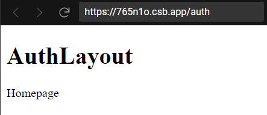
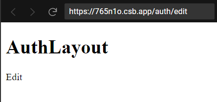

# `<Route />`

- `<Route />` là một component định nghĩa ra một định tuyến cho trang web
- Các **props** của component `<Route />`:

| Props     | Value                                                                                                                                                                                              |
| --------- | -------------------------------------------------------------------------------------------------------------------------------------------------------------------------------------------------- |
| `path`    | Là một `string` thể hiện một định tuyến<br />Nếu `path = "*"` thể hiện cho các path chưa được định nghĩa                                                                                           |
| `element` | Là một component chứa nội dung trang web tương ứng với định tuyến đó                                                                                                                               |
| `index`   | Được sử dụng ở bên trong một `<Route />` cấp **con** không có props **path** . Component của `<Route />` **con** này sẽ được render cùng với component của `<Route />` **cha** nếu có `<Outlet />` |

- Ví dụ:

```tsx
import React from "react";
import { BrowserRouter, Routes, Route } from "react-router-dom";
import Home from "./routeComponents/Home";
import About from "./routeComponents/About";
import Contact from "./routeComponents/Contact";
import Errorpage from "./routeComponents/Errorpage";
function App() {
  return (
    <BrowserRouter>
      <Routes>
        <Route path="/" element={<Home />} />
        <Route path="about" element={<About />} />
        <Route path="contact" element={<Contact />} />
        <Route path="*" element={<Errorpage />} />
      </Routes>
    </BrowserRouter>
  );
}
export default App;
```

- Ví dụ khi sử dụng props **index** :

```tsx
import React from "react";
import { Route, Routes, Outlet } from "react-router-dom";

const AuthLayout = () => {
  return (
    <>
      <h1>AuthLayout</h1>
      <Outlet />
    </>
  );
};

export default function App() {
  return (
    <Routes>
      <Route path="/auth" element={<AuthLayout />}>
        <Route index element={<p>Homepage</p>} />
        <Route path="edit" element={<p>Edit</p>} />
      </Route>
    </Routes>
  );
}
```




