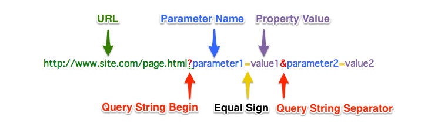

# useSearchParams()

- **useSearchParams()** là một hook giúp chúng ta xử lý liên quan đến query string trong đường dẫn.



- Cú pháp:

```tsx
import { useSearchParams } from "react-router-dom";

const App = () => {
    const [searchParams, setSearchParams] = useSearchParams();
    return (
        /*JSX Element*/
    )
}
```

| Property/Method     | Description                                                                                                                                                                                                                                                                                                                                                                                 |
| ------------------- | ------------------------------------------------------------------------------------------------------------------------------------------------------------------------------------------------------------------------------------------------------------------------------------------------------------------------------------------------------------------------------------------- |
| `searchParams`      | `searchParams` có kiểu là URLSearchParams, nó có các phương thức sau:<br />**searchParams.toString()** : trả về một String là query string hiện tại (không bao gồm dấu ?). Ví dụ: "name=Chi&age=20"<br />**searchParams.set(name: string, value: string)** : Chèn thêm một trường cùng giá trị của nó vào query string<br />**searchParams.delete(name: string)** : Xóa một trường theo tên |
| `setSearchParams()` | `setSearchParams(queryString: string)`<br />Nhận vào một string là query string. Ví dụ: `setSearchParams("name=Chi&age=20")`<br />Phương thức này giống hệt setState trong `useState()`. Component sẽ bị re-render sau khi setSearchParams()                                                                                                                                                |

- Thông thường, ta sử dụng thư viện **qs** để sử dụng xử lý liên quan đến query string
- Ví dụ:

```tsx
import { useEffect } from "react";
import { useSearchParams } from "react-router-dom";
import qs from "qs";

export default function App() {
  const [searchParams, setSearchParams] = useSearchParams();

  const handleClick = () => {
    const object = {
      name: "Chi",
      age: 20,
      address: {
        city: "Hanoi",
        district: "NamTuLiem",
      },
      card: ["Visa", "Vietcombank"],
    };
    setSearchParams(qs.stringify(object));
  };

  useEffect(() => {
    const queryString = searchParams.toString();
    console.log(qs.parse(queryString)); //Trả lại object tương ứng với query string
  });

  return <button onClick={handleClick}>Click me!</button>;
}
```
